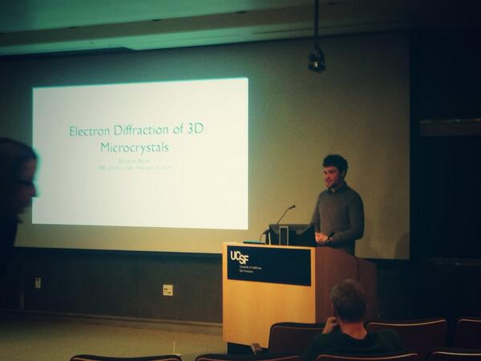

<h1 class="text-center">Benjamin Barad <small> Graduate Student </small></h1>

  	

  		
<ul><li> menu items will go here</li></ul>

  	

  	

  		
  	

Since 2013, I have been a graduate student studying Biophysics with James Fraser 
at UCSF. I am investigating methods for structural modelling and validation as 
well as the structural links between mutation and disease.Before that, I was an 
undergraduate at Stanford University studying Biological Chemistry, where I 
worked with Elizabeth Sattely investigating bacterial degradation of the plant 
polymer lignin. 